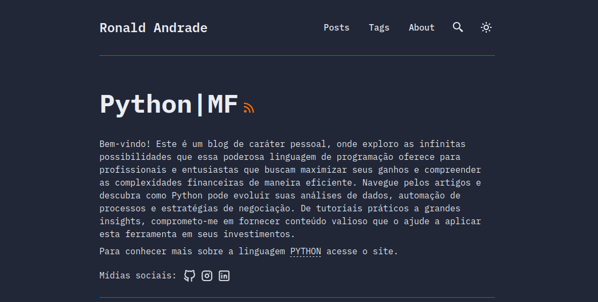

# Ronald Andrade Blog 📄




[](https://www.linkedin.com/in/ronaldandrademendonca/)

This is a personal blog, used for study, research, and information, where I talk about Python and the Brazilian financial market.[Click here for Visit](https://ronaldandrade.blog.br/).

The blog is entirely created by me, using Javascript, Typescript, with the Astro template.

## 🔥 Features
- [x] responsive (mobile ~ desktops)
- [x] light & dark mode
- [x] fuzzy search
- [x] draft posts & pagination

## 🚀 Project Structure
```bash
/
├── public/
│   ├── assets/
│   │   └── logo.svg
│   │   └── logo.png
│   └── favicon.svg
│   └── print_blog.png
│   └── toggle-theme.js
├── src/
│   ├── assets/
│   │   └── socialIcons.ts
│   ├── components/
│   ├── content/
│   │   |  blog/
│   │   |    └── some-blog-posts.md
│   │   └── config.ts
│   ├── layouts/
│   └── pages/
│   └── styles/
│   └── utils/
│   └── config.ts
│   └── types.ts
└── package.json
```
All blog posts are created in `.md` (Markdown) files.

## 💻 Tech Stack

**Main Framework** - [Astro](https://astro.build/)  
**Type Checking** - [TypeScript](https://www.typescriptlang.org/)  
**Component Framework** - [ReactJS](https://reactjs.org/)  
**Styling** - [TailwindCSS](https://tailwindcss.com/)  
**UI/UX** - [Figma](https://figma.com)  
**Fuzzy Search** - [FuseJS](https://fusejs.io/)  
**Icons** - [Boxicons](https://boxicons.com/) | [Tablers](https://tabler-icons.io/)  
**Code Formatting** - [Prettier](https://prettier.io/)  
**Deployment** - [Cloudflare Pages](https://pages.cloudflare.com/)  
**Illustration in About Page** - [https://freesvgillustration.com](https://freesvgillustration.com/)  
**Linting** - [ESLint](https://eslint.org)


## 📜 License

Licensed under the MIT License, Copyright © 2024

